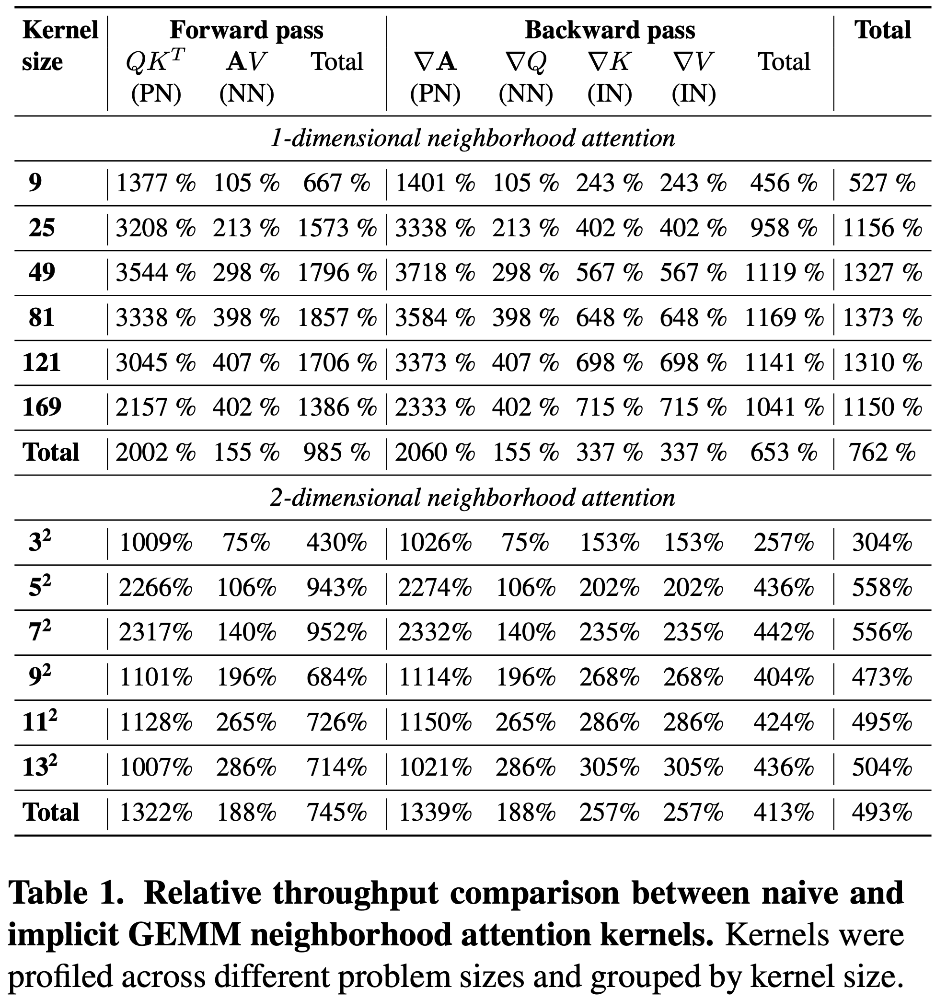

 

<a href="https://www.shi-labs.com/natten/"></a>

*Neighborhood Attention Extension*

Bringing attention to a neighborhood near you!

NATTEN is an open-source project dedicated to providing fast implementations for
[Neighborhood Attention](https://scholar.google.com/citations?view_op=view_citation&citation_for_view=Ndu0dUcAAAAJ:b0M2c_1WBrUC),
a sliding window self-attention mechanism.

If you're not familiar with neighborhood attention, we recommend referring to 
[our papers](https://github.com/SHI-Labs/Neighborhood-Attention-Transformer), or watching our 
[YouTube video](https://www.youtube.com/watch?v=Ya4BfioxIHA) from CVPR 2023.

NATTEN is primarily a C++/CUDA library, which has so far only supported binding with the torch API, and therefore is mostly
usable through PyTorch. We plan to eliminate the torch dependency in the future and possibly support other frameworks /
engines.

NATTEN's python interface provides <a href="https://arxiv.org/abs/2204.07143">Neighborhood Attention</a> (local attention)
and <a href="https://arxiv.org/abs/2209.15001">Dilated Neighborhood Attention</a> 
(sparse global attention, a.k.a. dilated local attention) as autograd-compatible PyTorch modules for both 1D, 2D, and 3D data. 

It also has experimental support for 
[forward mode automatic differentiation](https://pytorch.org/tutorials/intermediate/forward_ad_usage.html),
and nested tensors.

## CPU support
Our CPU implementations are very limited and barely performance-optimized.
While we aim to provide the best implementation for different devices, optimizing our CUDA kernels is higher up on the list of
priorities. Contributions are always welcomed.


## CUDA support
NATTEN generally supports all architectures supported by PyTorch. More specifically, architectures since Kepler (SM35) are
supported. However, our most-performant kernels only support architectures since Volta, targeting tensor core math.

### Half-precision support
Devices with compute capability greater than or equal to 6.0 (Pascal and later) allow running in FP16.

Devices with compute capability greater than or equal to 8.0 (Ampere and later) allow running in BF16.

### Naive kernels
NATTEN provides more than one set of kernel. Our naive kernels, which were developed during the first phase of the project,
provide a very basic implementation of neighborhood attention, and are the last resort for every problem. This means that if
your device and software support alternatives to our naive kernels (i.e. GEMM kernels), and your problem size is supported,
NATTEN will automatically pick the better kernels for you. (NOTE: this is done based on the class of kernels and not by actual
performance via profiling.)

Naive kernels are always usable across different architectures, though not the most performant.

### Tiled kernels
Naive kernels for the 2-dimensional neighborhood attention also come with a tiled implementation for one of the three
underlying operations, which is considerably more performant than the original. However, the tiled kernels only support problem
sizes with head dim 32, and up to kernel size 13x13.
Tiled kernels are also not supported in devices with compute capability smaller than 6.0.

### GEMM kernels.

Our GEMM-based kernels depend on and are modeled after 
[CUTLASS](https://github.com/NVIDIA/cutlass/)'s [Implicit GEMM](https://github.com/NVIDIA/cutlass/blob/main/media/docs/implicit_gemm_convolution.md) 
kernels for convolution.

Devices with compute capability greater than or equal to 7.0 (Volta, Turing, Ampere, Ada Lovelace, Hopper), can run our GEMM
kernels, which are somewhat performance-optimized, thanks to the underlying mainloop from CUTLASS, and target Tensor Core math.

However, do note that their current float16/bfloat16 implementations do not typically result in improved latency, 
due to a memory alignment issue, which we aim to resolve in future kernels.

Devices with compute capability greater than or equal to 8.0 (Ampere and later) support GEMM kernels with double, full, and
half precision (FP64, FP32, FP16, BF16).

Devices with compute capability 7.0 or 7.5 (Volta and Turing) only support GEMM kernels with half precision (FP16). This is
because their tensor cores only allow FP16 math.



NOTE: the table presents the average improvement in latency over different problem sizes with full precision (tfloat32).

### How do I check my compute capability / architecture?
Simple, just Google your GPU model, and check its compute capability.
If you've already set up NATTEN, you could also run:
```python
from natten.functional import get_device_cc

cc = get_device_cc()
cc = get_device_cc(0) # Optionally select a specific GPU

print(f"Your device is SM{cc}.")
```

### How do I know if I'm using the new kernels?
The new NATTEN library sets up constants that are binded to the python interface, which will allow you to
check whether you've compiled with: a. CUDA, b. Float16 (half) support, c. Bfloat16 support, d. New GEMM kernels.

```python
import natten

# Whether NATTEN was built with CUDA kernels, 
# and supports running them on this system.
print(natten.has_cuda())

# Whether NATTEN supports running float16 on
# the selected device.
print(natten.has_half())
print(natten.has_half(0)) # Optionally specify a GPU index.

# Whether NATTEN supports running bfloat16 on
# the selected device.
print(natten.has_bfloat())
print(natten.has_bfloat(0)) # Optionally specify a GPU index.

# Whether NATTEN supports running GEMM kernels
# on the selected device.
print(natten.has_gemm())
print(natten.has_gemm(0)) # Optionally specify a GPU index.

# Whether NATTEN supports running GEMM kernels
# in full precision on the selected device.
print(natten.has_fp32_gemm())
print(natten.has_fp32_gemm(0)) # Optionally specify a GPU index.
```

If `natten.has_gemm()` returns true, by default NATTEN will call the faster GEMM kernels instead of the original naive kernels
for both NA1D and NA2D. 3D Neighborhood attention is not supported at this time, but you can still use the naive kernels.

In addition, we will be adding scripts that allow you to profile and observe latency from the kernels with those options
available.

## About NATTEN
Sliding window self attention mechanisms have been relatively overlooked, in part due to implementation difficulties.
For example, in a paper proposing one of the earliest examples of such methods, 
[SASA](https://proceedings.neurips.cc/paper/2019/file/3416a75f4cea9109507cacd8e2f2aefc-Paper.pdf), 
it was noted that
although such methods are theoretically efficient, they're relatively slow in practice, compared to convolutions, 
which have been implemented in most well-known deep learning libraries.

That is why we started developing NATTEN, an extension to existing libraries with efficient implementations of sliding window
attention mechanisms, which will enable research in this direction including building powerful hierarchical vision
transformers.

For more information, we highly recommend reading our preprints [NAT](https://arxiv.org/abs/2204.07143) and
[DiNAT](https://arxiv.org/abs/2209.15001), and check out their [repository](https://github.com/SHI-Labs/Neighborhood-Attention-Transformer).

## Requirements

* python >= 3.8
* torch >= 2.0
 
NATTEN supports PyTorch version 2.0 and later, and Python versions 3.7, 3.8, 3.9, 3.10(only torch >= 1.11), and 3.11 (only torch >= 1.13).

Older NATTEN releases supported python >= 3.7 and torch >= 1.8.

**NOTE:** NATTEN only comes with pre-built Linux wheels, and supports Kepler and above (`SM >= 35`).
Make sure your GPU is supported by referring to 
[this webpage](https://arnon.dk/matching-sm-architectures-arch-and-gencode-for-various-nvidia-cards/).
Future versions will extend support to older GPUs.

## Getting started

### Linux
Just refer to our website, [shi-labs.com/natten](https://www.shi-labs.com/natten/), select your PyTorch version and the CUDA
version it was compiled with, copy-paste the command and install in seconds!

For example, if you're on `torch==2.0.0+cu118`, you should install NATTEN using the following wheel:
```bash
pip3 install natten -f https://shi-labs.com/natten/wheels/cu118/torch2.0.0/index.html
```

More generally:
```bash
pip3 install natten -f https://shi-labs.com/natten/wheels/{cu_version}/torch{torch_version}/index.html
```

**NOTE:** If you do not specify a wheel URL, pip will collect NATTEN and try to compile on locally, which depending
on your system might take up to 30 minutes.
We strongly recommend using our website if you're a Linux user.

### Mac
Unfortunately we are not yet able to build Mac wheels (and do not yet have a Metal backend). However, you can compile upon
installing and use the CPU kernels:

```bash
pip3 install natten
```

### Windows
The current release has not been successfully built Windows devices with CUDA, and therefore does not yet have Windows wheels.
If you are a windows user willing to help us figure out building with MSVC, please contact us or open an issue.

### Build from source
Once you've set up your Python environment and installed PyTorch with CUDA, simply clone and build:

```bash
git clone https://github.com/SHI-Labs/NATTEN
cd NATTEN

pip install -r requirements.txt

make
```

NOTE: NATTEN will use the PyTorch API to detect your GPU architecture, and will by default attempt to use 1/4th of the number
of processes your system allows to build. You can override them by passing in the following arguments:
```bash
# Build with 2 workers/processes
make WORKERS=2

# Build targeting SM89 (Ada Lovelace)
make CUDA_ARCH="8.9"
```

Please also note that building with the latest GEMM kernels can be a bit time consuming, which means at least 10 - 20 minutes
given that you use enough workers. It is technically possible to improve build time by generating more source files and using
more workers (at the expense of generating a larger binary), but that option will be made available in the future.

#### Optional: run unit tests
You can optionally run unit tests to verify building from source finished successfully:

```bash
make test
```


## Catalog
- [x] Neighborhood Attention 1D (CPU, naive)
- [x] Neighborhood Attention 2D (CPU, naive)
- [x] Neighborhood Attention 3D (CPU, naive)
- [x] Neighborhood Attention 1D (CUDA, naive)
- [x] Neighborhood Attention 2D (CUDA, naive)
- [x] Neighborhood Attention 3D (CUDA, naive)
- [x] Neighborhood Attention 1D (CUDA, gemm-based, SM70 and above)
- [x] Neighborhood Attention 2D (CUDA, gemm-based, SM70 and above)
- [x] Dilation support
- [x] Float16 support
- [x] BFloat16 support
- [x] Kepler and Maxwell (30<=SM<60) support
- [ ] Windows builds
- [ ] Neighborhood Attention 1D (CUDA, fused kernels)
- [ ] Neighborhood Attention 2D (CUDA, fused kernels)

## Usage
Simply import `NeighborhoodAttention1D`, `NeighborhoodAttention2D`, or `NeighborhoodAttention3D` from `natten`:
```python
from natten import NeighborhoodAttention1D
from natten import NeighborhoodAttention2D
from natten import NeighborhoodAttention3D

na1d = NeighborhoodAttention1D(dim=128, kernel_size=7, dilation=2, num_heads=4)
na2d = NeighborhoodAttention2D(dim=128, kernel_size=7, dilation=2, num_heads=4)
na3d = NeighborhoodAttention3D(dim=128, kernel_size=7, dilation=2, num_heads=4)
```

NA3D also supports different kernel size and dilation values for depth:
```python
na3d = NeighborhoodAttention3D(
	dim=128,
	kernel_size=7,
	kernel_size_d=5,
	dilation=2,
	dilation_d=3,
	num_heads=4)
```

Modules expect inputs of shape `[batch_size, *, dim]`:
* NA1D: `[batch_size, sequence_length, dim]`
* NA2D: `[batch_size, height, width, dim]`
* NA3D: `[batch_size, depth, height, width, dim]`


### FLOPs
We recommend counting flops through [fvcore](https://github.com/facebookresearch/fvcore).

```shell
pip install fvcore
```

Once you have fvcore installed, you can directly use our dedicated FLOP counter:
```python
from natten.flops import get_flops

flops = get_flops(model, input)
```

Alternatively, if you are using fvcore's `FlopCountAnalysis` directly, be sure to add our op handles:
```python
from fvcore.nn import FlopCountAnalysis
from natten.flops import add_natten_handle

# ...

flop_ctr = FlopCountAnalysis(model, input)
flop_ctr = add_natten_handle(flop_ctr)

# ...
```

## License
NATTEN is released under the [MIT License](LICENSE).

## Citation
```bibtex
@inproceedings{hassani2023neighborhood,
	title        = {Neighborhood Attention Transformer},
	author       = {Ali Hassani and Steven Walton and Jiachen Li and Shen Li and Humphrey Shi},
	year         = 2023,
        booktitle    = {IEEE/CVF Conference on Computer Vision and Pattern Recognition (CVPR)}
}
@article{hassani2022dilated,
	title        = {Dilated Neighborhood Attention Transformer},
	author       = {Ali Hassani and Humphrey Shi},
	year         = 2022,
	url          = {https://arxiv.org/abs/2209.15001},
	eprint       = {2209.15001},
	archiveprefix = {arXiv},
	primaryclass = {cs.CV}
}
```

## Acknowledgements
We would like to thank NVIDIA, and the [CUTLASS project](https://github.com/NVIDIA/cutlass/) and team for their efforts in
creating and open-sourcing CUTLASS. We would also like to thank Haicheng Wu for his valuable feedback and comments which led to
the creation of Implicit GEMM NA.
We also thank Meta, and the [PyTorch](https://github.com/pytorch/pytorch/) project and team.
