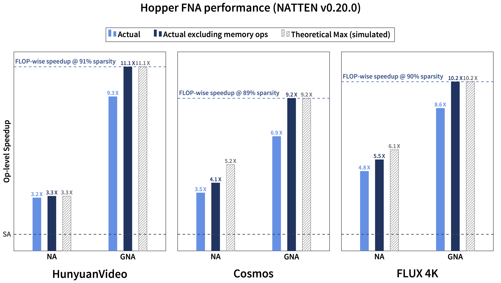
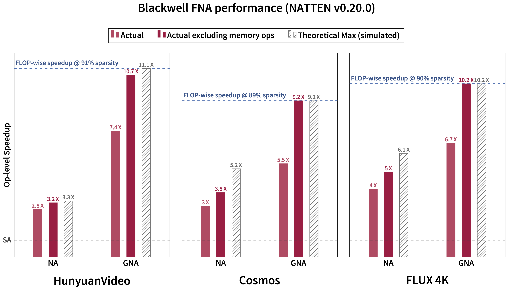

# Backends

In this page, we list our available implementations for standard attention (FMHA), and neighborhood
attention (FNA).

## CUTLASS FNA / FMHA

**Supported modes**

- [x] Inference (forward pass)
- [x] Training (backward pass)

{ width="80%" }
/// caption
Visualization of FNA, as proposed in
[Faster Neighborhood Attention (2024)](https://arxiv.org/abs/2403.04690).
///

Based on
[xFormers FMHA](https://github.com/NVIDIA/cutlass/tree/main/examples/41_fused_multi_head_attention)
(a.k.a. _memory-efficient attention_), this kernel is based on the CUTLASS 2.X API, and targets
multiple architectures: SM50 (Maxwell), SM70 (Volta), SM75 (Turing), and SM80 (Ampere).
You can use these kernels on any NVIDIA GPU with compute capability >= 5.0, and
both for training and inference.

Some newer architectures such as Hopper (SM90), and Blackwell (SM100) have much more performant
dedicated kernels, but they are limited to inference for now.

This implementation fuses multi-dimensional tiling directly into the kernel, but at the same time
may suffer from additional overhead of software predication.
To read more about this, we refer you to our
[Generalized Neighborhood Attention](https://arxiv.org/abs/2504.16922) paper, in which we also
proposed solutions such as Token Permutation, which we use to build our
[Hopper](#hopper-fna-fmha) and [Blackwell](#blackwell-fna-fmha) kernels.

### Finding configurations

You can use [profiler dry runs](profiler.md#dry-run) to find configurations for any of our
backends, and also find backends compatible with your device and use case. You can also use the
following functions in your code.

??? tip "Finding configurations for CUTLASS FMHA/FNA"
    ::: natten
        options:
              heading_level: 4
              show_signature: true
              separate_signature: true
              show_object_full_path: true
              members:
                  - get_configs_for_cutlass_fmha
                  - get_bwd_configs_for_cutlass_fmha
                  - get_configs_for_cutlass_fna
                  - get_bwd_configs_for_cutlass_fna

## Hopper FNA / FMHA

**Supported modes**

- [x] Inference (forward pass)
- [ ] Training (backward pass)

{ width="80%" }
/// caption
Performance levels of Hopper FNA as of version `0.20.0`.
///

Based on CUTLASS's
[Hopper FMHA kernel](https://github.com/NVIDIA/cutlass/tree/main/examples/88_hopper_fmha)
(3.X API), this backend offers non-persistent,
warp-specialized cooperative, and warp-specialized ping-ponging kernels, similar to
[Flash Attention 3](https://arxiv.org/abs/2407.08608). This kernel exhibits similar forward-pass
performance to Flash Attention 3.

This backend does not fuse multi-dimensional tiling into the kernel, and instead uses
[Token Permutation](https://arxiv.org/abs/2504.16922).

### Finding configurations

You can use [profiler dry runs](profiler.md#dry-run) to find configurations for any of our
backends, and also find backends compatible with your device and use case. You can also use the
following functions in your code.

??? tip "Finding configurations for Hopper FMHA/FNA"
    ::: natten
        options:
              heading_level: 4
              show_signature: true
              separate_signature: true
              show_object_full_path: true
              members:
                  - get_configs_for_cutlass_hopper_fmha
                  - get_configs_for_cutlass_hopper_fna

## Blackwell FNA / FMHA

**Supported modes**

- [x] Inference (forward pass)
- [ ] Training (backward pass)

{ width="80%" }
/// caption
Performance levels of Blackwell FNA as of version `0.20.0` (also
reported in
[Generalized Neighborhood Attention (2025)](https://arxiv.org/abs/2504.16922)).
///

Based on CUTLASS's
[Blackwell FMHA kernel](https://github.com/NVIDIA/cutlass/tree/main/examples/77_blackwell_fmha)
(3.X API), this backend offers incredible forward-pass performance, which is comparable with
cuDNN's Blackwell Attention.

This backend does not fuse multi-dimensional tiling into the kernel, and instead uses
[Token Permutation](https://arxiv.org/abs/2504.16922).

### Finding configurations

You can use [profiler dry runs](profiler.md#dry-run) to find configurations for any of our
backends, and also find backends compatible with your device and use case. You can also use the
following functions in your code.

??? tip "Finding configurations for Blackwell FMHA/FNA"
    ::: natten
        options:
              heading_level: 4
              show_signature: true
              separate_signature: true
              show_object_full_path: true
              members:
                  - get_configs_for_cutlass_blackwell_fmha
                  - get_configs_for_cutlass_blackwell_fna

## Flex FNA / FMHA

!!! warning
    This feature is experimental.

**Supported modes**

- [x] Inference (forward pass)
- [x] Training (backward pass)

!!! info inline end
    This feature requires PyTorch >= 2.7.

This backend is PyTorch-native, and supports some non-NVIDIA devices as well (CPU and ROCm).
It is based on 
[Flex Attention](https://docs.pytorch.org/docs/stable/nn.attention.flex_attention.html#module-torch.nn.attention.flex_attention).

Since this backend is implemented in PyTorch, fusion of multi-dimensional tiling is not possible.
This backend however does support [Token Permutation](https://arxiv.org/abs/2504.16922), similar to
the Hopper and Blackwell backends.

By default, if tile shapes are not specified, token permutation will be disabled, and our
legacy Flex mask will be used.
If tile shapes are specified, it will use token permutation.

### Finding configurations

You can use [profiler dry runs](profiler.md#dry-run) to find configurations for any of our
backends, and also find backends compatible with your device and use case. You can also use the
following functions in your code.

??? tip "Finding configurations for Flex FMHA/FNA"
    ::: natten
        options:
              heading_level: 4
              show_signature: true
              separate_signature: true
              show_object_full_path: true
              members:
                  - get_configs_for_flex_fmha
                  - get_configs_for_flex_fna
