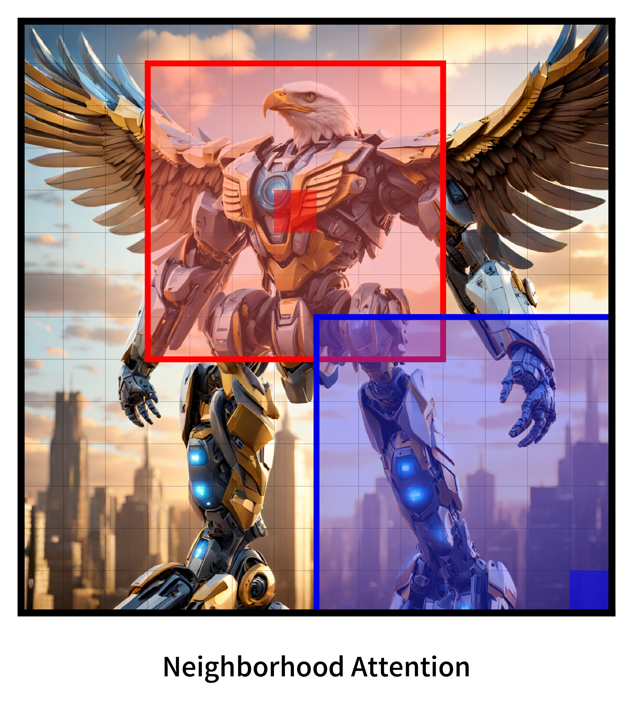
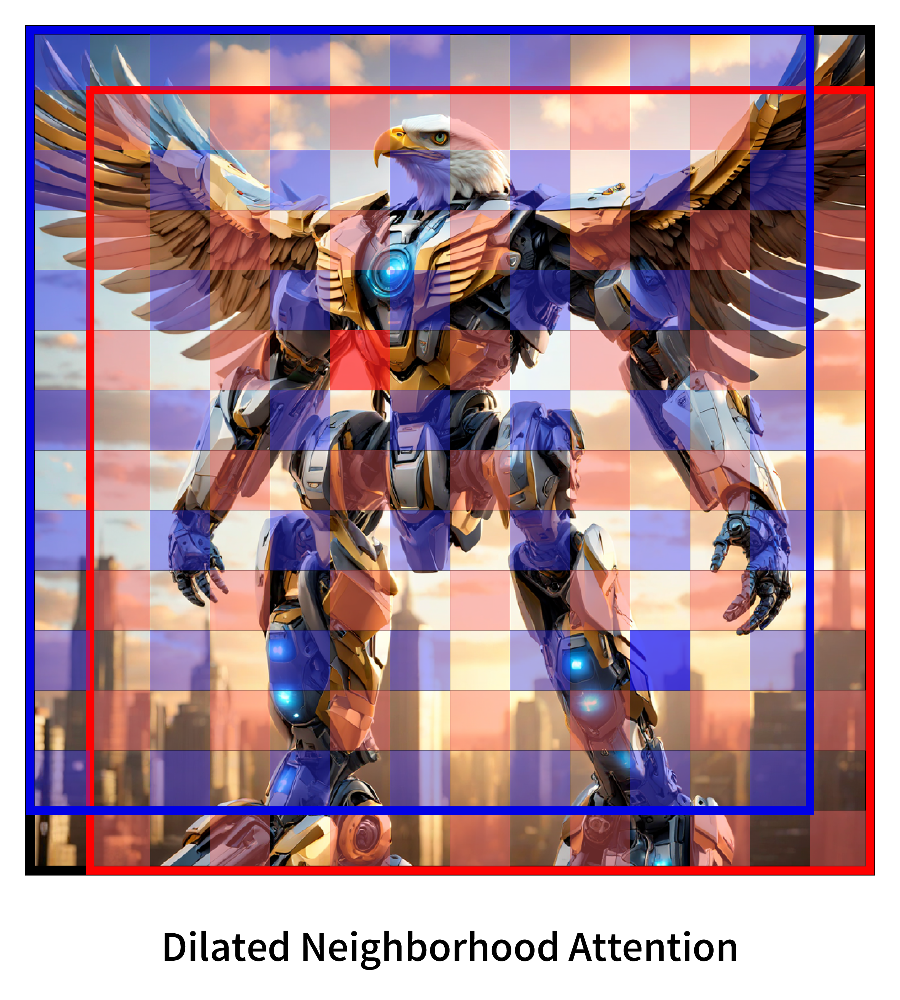

## NATTEN history

NATTEN is a deep learning extension, currently only supporting [PyTorch](https://pytorch.org/), aimed at providing easy-to-use
implementations of [Neighborhood Attention](https://arxiv.org/abs/2204.07143), a sliding window attention pattern.
Implementing sliding window attention patterns primarily through higher-level tensor libraries can be challenging, especially
in the case of 2-D and 3-D sliding windows. Even though the standard sliding window attention can be expressed as tensor views,
the same does not hold true for neighborhood attention, ruling out the possibility of using existing attention / matrix
multiplication operations that are flexible in terms of operating on tensor views.

<picture>
  <source media="(prefers-color-scheme: dark)" srcset="assets/neighborhood_attn_2d_vis_dark.png">
  
</picture>
<picture>
  <source media="(prefers-color-scheme: dark)" srcset="assets/dilated_neighborhood_attn_2d_vis_dark.png">
  
</picture>

NATTEN started off as part of the 
[Neighborhood Attention Transformer](https://github.com/SHI-Labs/Neighborhood-Attention-Transformer) project, which, at its
inception, only consisted of a pure PyTorch implementation, which converted KV tensors into sliding window views, and then used
replicated padding to generate the neighborhood attention KV. Because the final KV tensor was typically very large and
contiguous, global memory usage grew significantly larger than the standard self attention implementation.
In addition, the underlying attention operation, a batched matrix-vector multiplication, was heavily bounded by memory.

As a result, small vision models that normally would take about a day to train on 8 PCIe A100s took over 9 days to train,
rendering one of the primary theoretical advantages of neighborhood attention invalid: its linear complexity and memory usage.
This, among other reasons, led to neighborhood attention being implemented with custom naive CUDA kernels, which, once
slightly performance optimized (and thanks to compiler optimizations) managed to reach reasonable performance, but of course,
still lagged behind baseline models that were easily implemented using native PyTorch ops, which typically end up calling GEMM
routines from libraries such as cuBLAS and cuDNN.
It was not until some of the kernels were rewritten to utilize shared memory that models based on neighborhood attention
started exhibiting competitive FP32 performance on Ampere.

 

Nevertheless, naive kernels written from scratch can only take you so far, especially when the problem you're trying to
accelerate is mostly compute bound (attention), while yours is memory bound (neighborhood attention).
Due to this, NATTEN's purpose shifted from being a mere extension carrying a few naive kernels with no dependencies other than
torch and the cuda runtime, to a package that would eventually contain a variety of implementations for different
use cases.
It was therefore separated into its own repository as of October 2022, and packaged as a PyPi-installable Python package.

For more information on this, please refer to:

* [Methodology](methodology/README.md)
* Neighborhood Attention Transformer | [Paper](https://arxiv.org/abs/2204.07143) | [Video](https://www.youtube.com/watch?v=Ya4BfioxIHA)
* Dilated Neighborhood Attention Transformer | [Paper](https://arxiv.org/abs/2209.15001)
