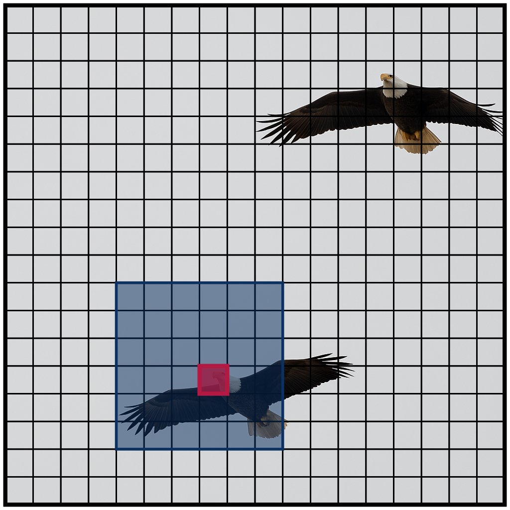
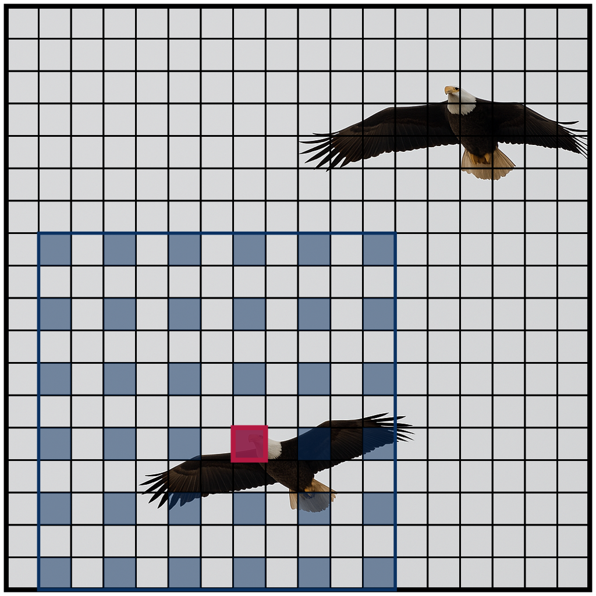
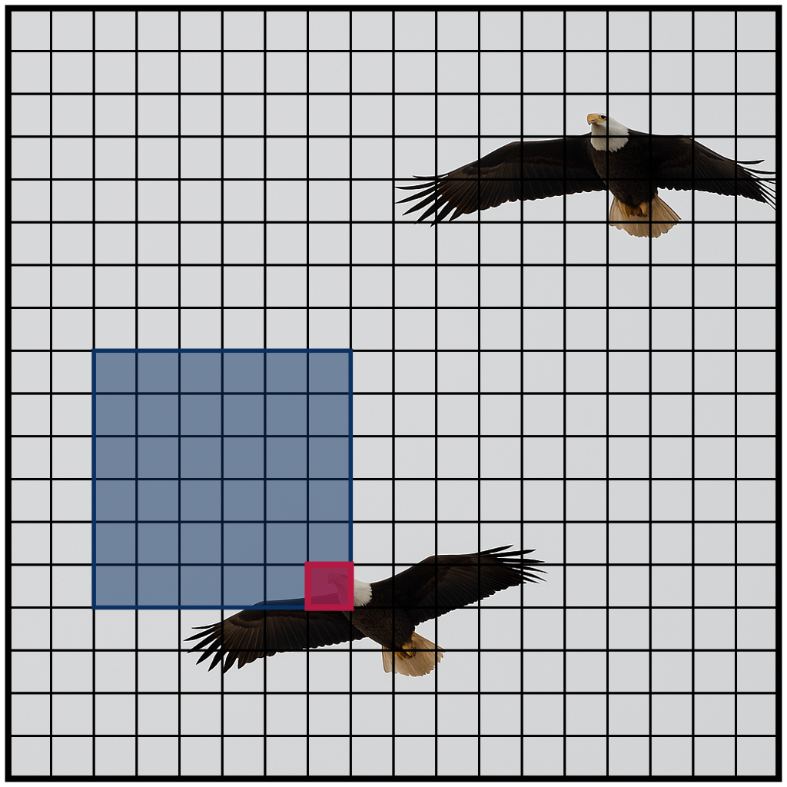
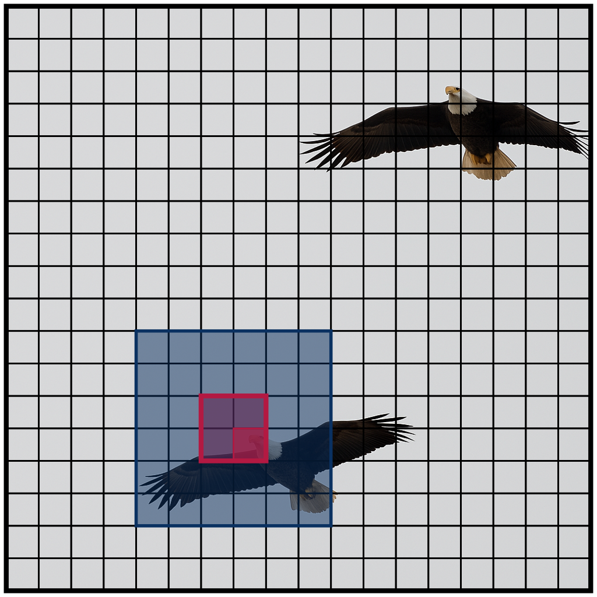

---
hide:
  - toc
  - navigation
---

<a href="https://pypi.org/project/natten/"></a>
&nbsp;
<a href="https://natten.org/install/"></a>

NATTEN is an open-source project dedicated to providing infrastructure for
**multi-dimensional** sparse attention methods, specifically
[Neighborhood Attention (NA)](https://openaccess.thecvf.com/content/CVPR2023/html/Hassani_Neighborhood_Attention_Transformer_CVPR_2023_paper.html),
a sliding window self-attention mechanism, and its extensions
([dilated NA](https://arxiv.org/abs/2209.15001),
[causal NA](https://arxiv.org/abs/2403.04690),
[strided NA](https://arxiv.org/abs/2504.16922)).
We provide Fused Multi-Headed Attention (FMHA) and
[Fused Neighborhood Attention (FNA)](https://arxiv.org/abs/2403.04690)
training and inference kernels, for all NVIDIA architectures since Maxwell (SM50).
We also ship
[Hopper (SM90) and Blackwell (SM100)](https://arxiv.org/abs/2504.16922) native kernels, offering
speedups proportional to reduction in FLOPs over cuDNN and Flash Attention 3.

Neighborhood Attention introduces locality and sparsity into self attention in a manner similar to
convolution.
This means for any self attention problem, you will be able to specify a `kernel_size`, `stride`,
and `dilation`. Because it's attention, you can also toggle causal masking.

NATTEN is dedicated to multi-dimensional layouts of tokens (i.e.
[2-D][natten.na2d] and
[3-D][natten.na3d] feature maps).
Users have the freedom to explore the massive parameter space that NATTEN offers, in which the
attention span in any dimension/axis of your input can be controlled with its respective
`kernel_size`, `stride`, `dilation`, and `is_causal` parameters.


<div class="image-box">
  <figure class="figure">
      
    <figcaption class="code-caption">
        ``` { .python .no-copy }
        na2d(
            q, k, v,
            kernel_size=(6, 6)
        )
        ```
    </figcaption>
  </figure>
  <figure class="figure">
      
    <figcaption class="code-caption">
        ``` { .python .no-copy }
        na2d(
            q, k, v,
            kernel_size=(6, 6),
            dilation=(2, 2))
        ```
    </figcaption>
  </figure>
</div>

<div class="image-box">
  <figure class="figure">
      
    <figcaption class="code-caption">
        ``` { .python .no-copy }
        na2d(
            q, k, v,
            kernel_size=(6, 6),
            is_causal=(True, True))
        ```
    </figcaption>
  </figure>
  <figure class="figure">
      
    <figcaption class="code-caption">
        ``` { .python .no-copy }
        na2d(
            q, k, v,
            kernel_size=(6, 6),
            stride=(2, 2))
        ```
    </figcaption>
  </figure>
</div>

## Getting started

NATTEN supports PyTorch >= 2.7, and Python >= 3.9 (everything PyTorch supports).
Please refer to [install instructions](install.md) for details on how to install NATTEN.

### :fire: Release `0.21.0`

NATTEN has undergone major changes since the last release (`0.17.5`), so we strongly recommend
reading our new updated documentation in this webpage before upgrading.

Our latest release ships our [Hopper FNA](backends.md#hopper-fna-fmha) and
[Blackwell FNA](backends.md#blackwell-fna-fmha) kernels, bringing you
[massive speedups](profiler.md#hopper-and-blackwell-examples) on
modern data center class NVIDIA GPUs such as the H100 and B200.
It also speeds up inference in our existing
[Ampere FNA](backends.md#cutlass-fna-fmha) kernels up to 1.47X in fully
block-sparse cases, provides much cleaner error reporting, ships with our
[profiling toolkit](profiler.md), and so much more!

## License
NATTEN is released under the [MIT License](https://github.com/SHI-Labs/NATTEN/tree/main/LICENSE).

## Citation
If you found NATTEN, or neighborhood attention useful in your work, consider citing the appropriate
papers:

### Original neighborhood attention paper
First work proposing neighborhood attention, and introducing NATTEN.

```bibtex
@inproceedings{hassani2023neighborhood,
  title        = {Neighborhood Attention Transformer},
  author       = {Ali Hassani and Steven Walton and Jiachen Li and Shen Li and Humphrey Shi},
  year         = 2023,
  booktitle    = {IEEE/CVF Conference on Computer Vision and Pattern Recognition (CVPR)}
}
```

<a href="https://arxiv.org/abs/2204.07143" class="md-button md-button--primary" target="_blank">
    :simple-arxiv: arXiv
</a>
<a href="https://github.com/SHI-Labs/Neighborhood-Attention-Transformer" class="md-button" target="_blank">
    :simple-github: GitHub
</a>

### Dilated neighborhood attention
Introduced `dilation` for introducing sparse global context.

```bibtex
@article{hassani2022dilated,
	title        = {Dilated Neighborhood Attention Transformer},
	author       = {Ali Hassani and Humphrey Shi},
	year         = 2022,
	journal      = {arXiv preprint arXiv:2209.15001}
}
```

<a href="https://arxiv.org/abs/2209.15001" class="md-button md-button--primary" target="_blank">
    :simple-arxiv: arXiv
</a>
<a href="https://github.com/SHI-Labs/Neighborhood-Attention-Transformer" class="md-button" target="_blank">
    :simple-github: GitHub
</a>

### GEMM-based and fused neighborhood attention

Introduced the first multi-dimensional attention kernels: GEMM-based and fused neighborhood
attention (FNA).

Introduced causal neighborhood attention, and extended implementation to support varying parameters
across different dimensions.

```bibtex
@inproceedings{hassani2024faster,
  title        = {Faster Neighborhood Attention: Reducing the O(n^2) Cost of Self Attention at the Threadblock Level},
  author       = {Ali Hassani and Wen-Mei Hwu and Humphrey Shi},
  year         = 2024,
  booktitle    = {Advances in Neural Information Processing Systems},
}
```

<a href="https://arxiv.org/abs/2403.04690" class="md-button md-button--primary" target="_blank">
    :simple-arxiv: arXiv
</a>

### Generalized neighborhood attention: towards speed-of-light performance
Introduced even-sized windows, strided neighborhood attention, block-sparse forms of neighborhood
attention, NATTEN Simulator, and our new Hopper and Blackwell FNA kernels, implemented with
out-of-kernel token permutation.

```bibtex
@article{hassani2025generalized,
	title        = {Generalized Neighborhood Attention: Multi-dimensional Sparse Attention at the Speed of Light},
	author       = {Hassani, Ali and Zhou, Fengzhe and Kane, Aditya and Huang, Jiannan and Chen, Chieh-Yun and Shi, Min and Walton, Steven and Hoehnerbach, Markus and Thakkar, Vijay and Isaev, Michael and others},
	year         = 2025,
	journal      = {arXiv preprint arXiv:2504.16922}
}
```

<a href="https://arxiv.org/abs/2504.16922" class="md-button md-button--primary" target="_blank">
    :simple-arxiv: arXiv
</a>

## Acknowledgements

We thank NVIDIA, and the [CUTLASS project](https://github.com/NVIDIA/cutlass/), without which this
project would not have been possible.

We also thank Meta and the [xFormers](https://github.com/facebookresearch/xformers/) team
for their FMHA kernel, and the [PyTorch](https://github.com/pytorch/pytorch/) project and team.
